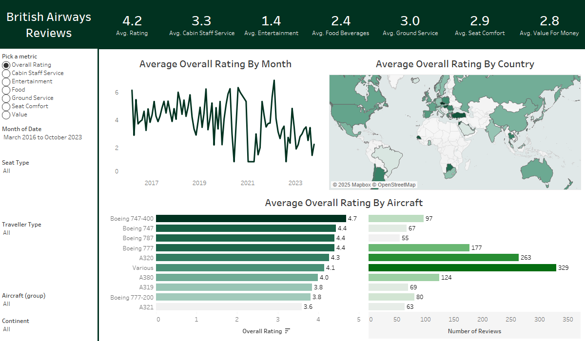

# British-Airways-Review
[Tableau Public link](https://public.tableau.com/views/BritishAirwaysReviews_17379346342600/Dashboard1?:language=en-US&publish=yes&:sid=&:redirect=auth&:display_count=n&:origin=viz_share_link)
 

## Project Overview
This project provides an interactive data visualization dashboard created using Tableau. The dashboard explores British Airways customer reviews, allowing users to visualize key metrics such as overall ratings, cabin service, entertainment, food, ground service, seat comfort, and value for money. It includes features like rating trends over time, ratings by country, and by aircraft type.

## Features
- **Average Overall Rating by Month**: A time series plot showing how the overall ratings change over time (from March 2016 to October 2023).
- **Average Overall Rating by Country**: A map visualization displaying how British Airways is rated across different countries.
- **Average Overall Rating by Aircraft**: A bar chart comparing customer satisfaction across different aircraft types.
- **Ratings for Different Metrics**: Ability to explore specific ratings for Cabin Staff Service, Entertainment, Food, Ground Service, Seat Comfort, and Value for Money.

## Technologies Used
- **Tableau**: Data visualization tool used to create the dashboard.
- **Data Source**: Customer reviews for British Airways from March 2016 to October 2023, covering aspects like cabin service, entertainment, food, and more.
